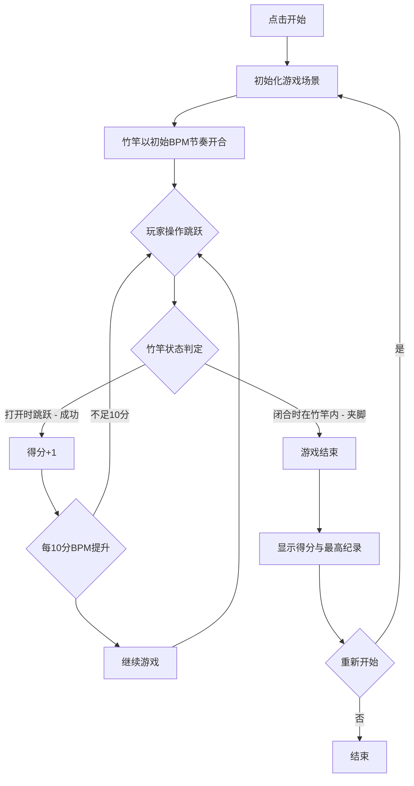

## 1. 产品概述

竹竿舞小游戏是一款基于节奏的休闲挑战游戏，玩家操控舞者跟随竹竿开合的节奏在竹竿间跳跃，避免被竹竿夹脚。游戏节奏逐渐加快，连续成功跳跃次数即为得分。

- 目标用户：喜欢休闲节奏游戏的玩家
- 核心价值：简单易上手、节奏感强、挑战性递增的趣味体验

## 2. 核心功能

### 2.1 功能模块

1. **游戏主页面**：竹竿阵侧视图、两名操作者、舞者角色、节奏指示器、计分板
2. **开始/结束页面**：游戏标题、开始按钮、游戏结束画面、最终得分、重新开始

### 2.2 页面详情

| 页面名称 | 模块名称 | 功能描述 |
|----------|----------|----------|
| 游戏主页面 | 竹竿阵场景 | 侧视图展示3-5对竹竿，两名操作者站在竹竿两端开合竹竿 |
| 游戏主页面 | 舞者控制 | 玩家通过空格键/点击控制舞者跳跃，舞者可在竹竿间移动 |
| 游戏主页面 | 节奏指示器 | 顶部显示当前节奏BPM，视觉节拍提示 |
| 游戏主页面 | 计分板 | 显示当前连续成功跳跃次数和最高纪录 |
| 游戏主页面 | 竹竿碰撞检测 | 竹竿闭合时若舞者在竹竿内则判定夹脚失败 |
| 开始页面 | 标题与操作 | 游戏标题"竹竿舞"、开始按钮、简单操作说明 |
| 结束页面 | 结果展示 | "被夹住了！"提示、本次得分、最高纪录、重新开始按钮 |

## 3. 核心流程

玩家点击开始 → 游戏初始化，竹竿以初始BPM节奏开合 → 舞者站在竹竿阵一侧 → 玩家按空格键/点击让舞者跳跃进入竹竿间 → 每次竹竿开合为一个节拍 → 舞者需在竹竿打开时跳跃、闭合前离开 → 连续成功跳跃计分 → 每得10分BPM提升 → 竹竿闭合时舞者在竹竿范围内则判定夹脚 → 游戏结束 → 显示得分 → 可重新开始

## 4. 用户界面设计

### 4.1 设计风格

- 主色调：暖黄/橙色（竹子质感）+ 深棕色（背景）+ 红色（舞者/强调）
- 按钮风格：圆角木质纹理按钮，带有竹子元素装饰
- 字体：使用具有东方韵味的中文字体，标题用书法风格
- 布局风格：全屏游戏画面，顶部HUD显示信息，底部操控区域
- 图标风格：简笔竹子/竹叶风格的装饰元素

### 4.2 页面设计概览

| 页面名称 | 模块名称 | UI元素 |
|----------|----------|--------|
| 游戏主页面 | 竹竿阵场景 | 侧视图Canvas，深棕色背景，暖黄色竹竿，两名操作者角色动画 |
| 游戏主页面 | 舞者 | 红色服饰角色，跳跃动画，站立/跳跃两种姿态 |
| 游戏主页面 | 节奏指示器 | 顶部BPM数值显示，节拍闪烁圆点 |
| 游戏主页面 | 计分板 | 右上角分数显示，最高纪录显示 |
| 开始页面 | 标题 | 大号书法字体"竹竿舞"，竹叶装饰 |
| 开始页面 | 操作说明 | "空格键/点击 跳跃"提示文字 |
| 结束页面 | 结果展示 | "被夹住了！"红色提示，分数高亮显示 |

### 4.3 响应式设计

- 桌面端优先，Canvas自适应屏幕宽度
- 移动端支持触摸点击跳跃
- 最小宽度适配360px

### 4.4 游戏场景设计

- 场景视角：侧视图（2D横向）
- 竹竿阵：3-5对水平竹竿，上下两根为一对
- 操作者：竹竿两端各一人，做开合动作动画
- 舞者：从左侧进入，在竹竿间左右跳跃
- 背景：渐变深棕色底，远处山峦剪影，竹叶飘落粒子效果
