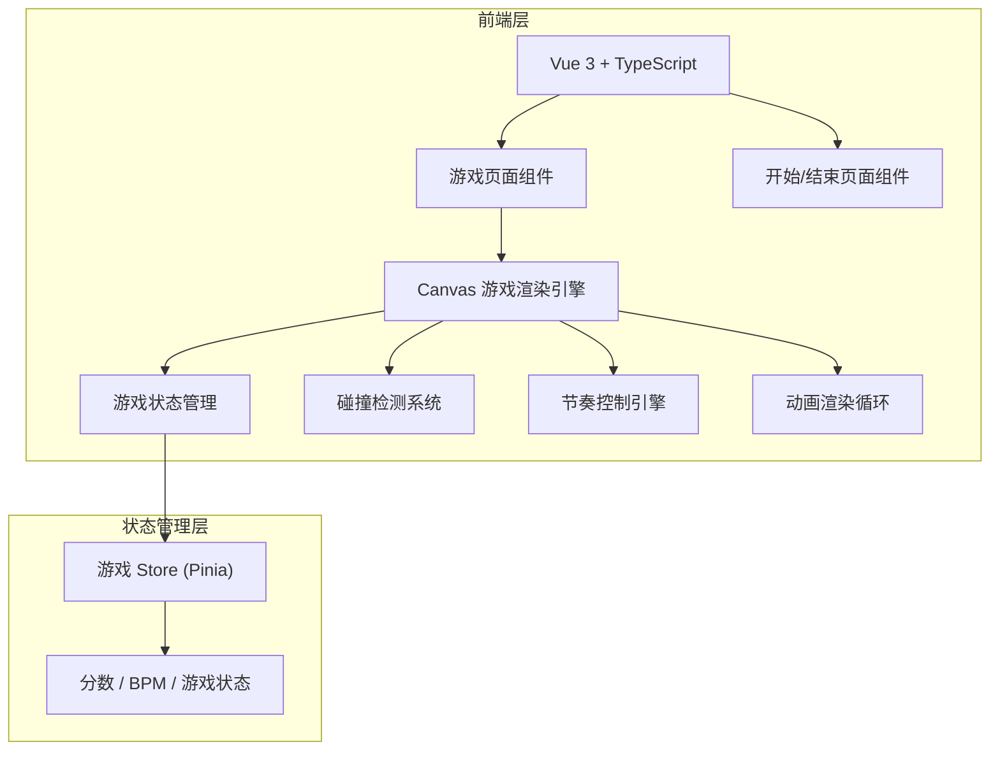
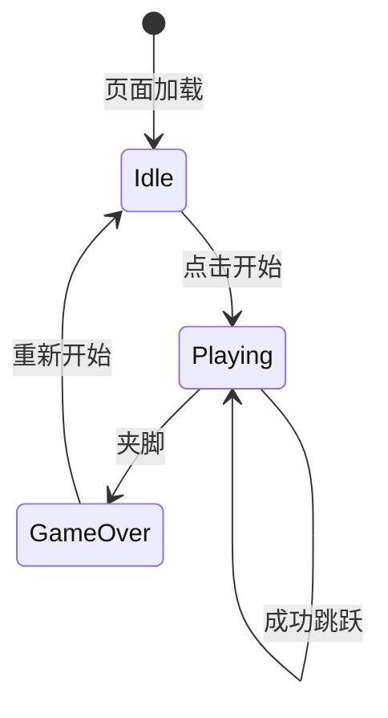

## 1. 架构设计



## 2. 技术说明

- 前端：Vue 3 + TypeScript + Vite
- 样式：Tailwind CSS
- 状态管理：Pinia
- 游戏渲染：HTML5 Canvas 2D
- 初始化工具：vite-init（vue-ts 模板）
- 后端：无
- 数据库：无（本地 localStorage 存储最高纪录）

## 3. 路由定义

| 路由 | 用途 |
|------|------|
| / | 游戏主页面（包含开始、游戏中、结束三个状态的切换） |

## 4. 游戏核心系统设计

### 4.1 游戏状态机



### 4.2 竹竿系统

- 竹竿对数：4对（可配置）
- 每对竹竿由上下两根组成
- 状态：`open`（打开）和 `close`（闭合）
- 开合周期：基于当前BPM计算，一个节拍开、一个节拍合
- 各对竹竿之间有固定间距

### 4.3 舞者系统

- 位置：水平方向在竹竿间移动
- 状态：`standing`（站立）和 `jumping`（跳跃中）
- 跳跃：玩家按键后舞者向上跳起并水平移动到下一对竹竿间
- 跳跃时间：约0.3秒（可随BPM调整）

### 4.4 碰撞检测

- 竹竿闭合瞬间检测舞者位置
- 若舞者的水平位置在某对竹竿范围内，且舞者未处于跳跃状态（即脚在竹竿高度内），判定夹脚
- 舞者跳跃时脚部高于竹竿，不判定碰撞

### 4.5 节奏系统

- 初始BPM：80
- 每得10分BPM提升5
- 最大BPM：200
- 节拍间隔 = 60000 / BPM（毫秒）
- 视觉节拍提示：每拍闪烁

### 4.6 计分系统

- 每次成功跳跃（从一对竹竿间跳到下一对竹竿间且未被夹住）+1分
- 从最后一对竹竿跳出后循环回到第一对竹竿
- 最高纪录存储在 localStorage

## 5. 项目文件结构

```
src/
├── App.vue                    # 根组件
├── main.ts                    # 入口文件
├── stores/
│   └── game.ts                # 游戏状态 Store
├── composables/
│   ├── useGameLoop.ts         # 游戏主循环
│   ├── useRhythm.ts           # 节奏控制
│   └── useCollision.ts        # 碰撞检测
├── components/
│   ├── GameCanvas.vue         # Canvas 游戏渲染组件
│   ├── GameHUD.vue            # 游戏 HUD（分数、BPM）
│   ├── StartScreen.vue        # 开始画面
│   └── GameOverScreen.vue     # 结束画面
├── game/
│   ├── renderer.ts            # Canvas 渲染器
│   ├── entities.ts            # 游戏实体（竹竿、舞者、操作者）
│   └── constants.ts           # 游戏常量
├── pages/
│   └── GamePage.vue           # 游戏页面
└── style.css                  # 全局样式
```
